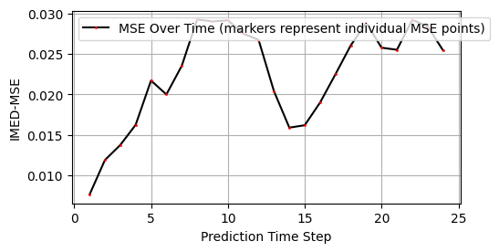

#### Applying ESN to CESM

After the successful implementation of ESN onto the SWE, I now proceded to seeing how the "virtual" ocean fares.

**Available Data - CESM** 

- 1/10 deg resolution
- monthly output
- from GCS_2015_2017 - _Can I maybe habe more information about the set-ups of the run/ documentation?_
- Jan 2016 - Aug 2022 (**Note: Sep 2022 is corrupt!**)
- data downloaded by James from ERDA onto threadripper02 - **only 81 files available** (80 of them not corrupted)
    --> **_is that enough to sensibly train and pred??_**

**Problems I have encountered**
- the data is **very** large
    --> pre-processing with nco required (even for 81 files it took several hours)
- there were NaNs in the data that the ESN couldn't handle, so I set them to zero **(this could potentially lead to problems!)**

**Hyperparameter Tuning**

I did a brief hyperparameter adjustment: 
- changed dtype = "float64" to "float32" (bc the CESM data had that type)
- otherwise kept the hyperparameters that the HP Testing yielded, see [here](./Hyperparameter_Tuning_SWE.md)

esn001
- nPCs = 5
- sigma_xy = 2.5
- k = 0.001 

esn002
- sigma_xy = 0.1
    _is this corresponding to 1/10 deg??_

esn003 
- k = 0.5

esn004
- n_PC = 50

esn005 
- N_PC = 350

see yaml file [here](./esn_arguments_CESM_005.yaml)

**Results**

[Animation](./comparison_CESM_005.mp4)

A beautiful jupyter notebook can be accessed here. [Link to beautiful notebook](/code/Apply_ESN_to_CESM_1st_try.ipynb)

