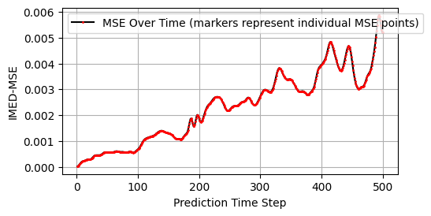
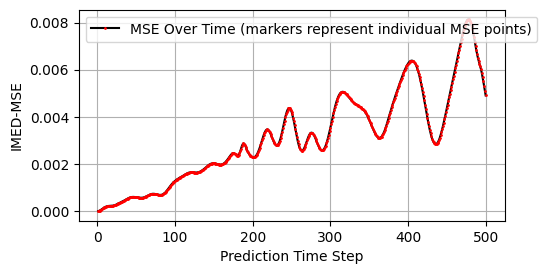

## Adjusting the SWE Model

After tuning the model to a simple SWE model with symmetric disturbance, I shifted, the disturbance off centre (to the lower left corner). 

As already pointed out by Jacob, the blurring properties of sigma_xy have a major effect and can become overly sensitive to noise (numerical instabilities). 

At sigma_xy = 2, mse started to increase drastically as the prediction time went on (see figure below)

However, it was also Jacob who stressed the point that we should prefer an esn which captures the dynamic evolution over one that minimizies the mse. 

**Run 23**

- optimal hyperparameter settings described [here](./Hyperparameter_Tuning_SWE.md)

[Animation](./comparasion_23.mp4)

**Run 24** 

- set sigma_xy = 3
- prediction got more blurry (as expected)
- mse didn't improve much, but missed some small scale features

[Animation](./comparasion_24.mp4)

**Run 25** 

- sigma_xy = 2.5
- still too blurry in my opinion
- I personally would settle for the HPs **run 23**

The Name of the Dataset used was "shallow2D_4500_128_128_2.npy"
