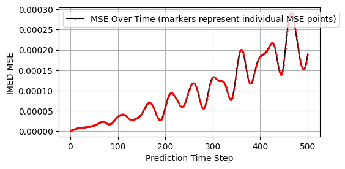

## Running the ESN on a more interesting SWE Model 

After adjusting the domain size to Lx, Ly = (256, 256) and shifting the disturbance off centre, I now present some more interesting results. 

**Run 28 - symmetric**

[Animation](./comparison_28.mp4)

An animation of the whole evolution can be found here

[shallow2D_4500_128_128](./Anim_4500_128_128_4.mp4)

An upload of the data was unfortunately not possible due to size limitations.

**Run 29 - asymmetric**

