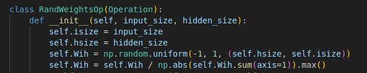

#### **Hyperparameter Tuning Kuroshio** 

After many tries, I realised that there's a particular dependence on the input mapping functions "vorticity" and "gradient", which are extremly sensitive to the skaling parameter, which is 1 and 0.1 respectively for the detrended time series and 1e-3 for the whole time series.

The input mappings/ operations are defined as followed: 

note that I modified the original code by Jacob to substract the mean vorticity

and 

Additionally I found a further dependence on the random weights operation, where a too small factor led to overfitting and the model becoming unphysically turbulent with time. 

One parameter setting, I was satisfied with, is described [here](./esn_arguments_45.yaml)

And the animation is available [here](./comparison_45.mp4)
