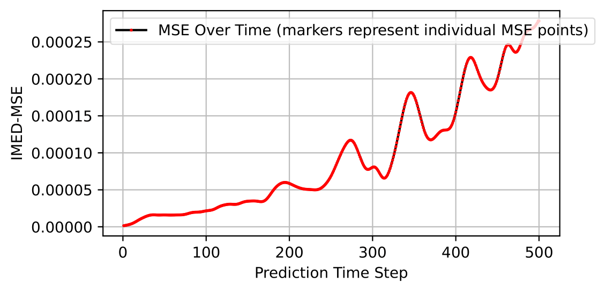

# Hyperparameter Tuning of the SWE

According to Jacob's thesis the most essential parameters, to which the ESN reacts sensitive are: 

- spectral radius rho
- input scaling k
- princ. component N_PC
- sigma
- N_hidden determinded by specs

**The Data:** 

- started with 2000x256x256 data array (t, x, y) with (1499 train, 300 pred, 200 trans)
- ended with 4500x128x128 with (3000 train, 500 pred, 200 trans) (see table below for further info)
- models saved in Hannah/SWE_hp_test_256_256

**Hyperparameters I _didn't_ change**

- dtype = "float64"
- ST method = "DCT"
- cpus_to_use _ 32
- scale_min = -1
- scale_max = 1
- upper_sr_calc = 5000
- random_seed = np.random_seed
- rho = 0.98
- neuron_connections = 100
- eps = 0.01
- lstsq_method = "svd"
- lestsq_tres = 0.001
- neuron_distribution = "normal"
- specs: "pixels", "conv" (5,5) "random", "gradient", "dct" (30,30)

**Hyperparameter Experiments**

| esn # | time [s]| mse    | specs    | N_PC    | sigma       | General Remarks
|-------|---------|--------|----------|---------|-------------|----------------
| 1     | 229     | 0.029  | k = 0.001| 350     | (0.2, 3, 3) | not great, changed dataset to t = 4500 with (3000 train, 1000 pred, 200 trans)
| 2     |         |        |          |         |             | too slow had to be interrupted, changed dataset to 64x64
| 3     | 12.7    | 0.0046 |          |         |             | very blurry
| 4     |         |        |          |         | (1, 5, 5)   | even more blurry, changed data to (x,y) = 128x128 and Npred = 500
| 5     | 135.6   | 0.003  |          |         |             | slower, but sharper
| 6     |         | 0.005  |          |         | (0.2, 3, 3) | better, but I am still not happy, changed amplitude in SWE data to make the signal stronger
| 7     | 142.6   | 0.0004 |          |         | (0.2, 3, 3) | 
| 8-14  | 134.2   | 0.0002 |          |         |(0.2,2.5,2.5)| changed plotting method so it scales min max by 4/5
| 15    |         | 4e-5   |          |         | (0.2, 2, 2) | very nice
| 16    | 148     | 3e-5   |          | 1000    |             | no noticible difference
| 17    | 152     | 4-5    | + gauss* |         |             | no noticible difference *gauss =  "conv" (5,5) "gauss"
| 18    |         | 0.0002 |          |         |(0.2,1.5,1.5)| noise starting to appear
| 19    | 139     | 0.0001 |k = 0.0001|         |             | 
| 20    | 134     | 0.002  | k = 0.01 |         |             |

**Summary** 

I found that following parameters yield the best results (from run 15): 

- k = 0.001
- N_PC = 350
- sigma = (0.2, 2, 2)

see yaml file for all parameter settings [here](./esn_arguments_15.yaml)

**Plot of the MSE of Run 15**

**Animation of Run 15**

[Animation](./comparison_15.mp4) 

An animation of the whole evolution can be found here

[shallow2D_4500_128_128](./Anim_4500_128_128.mp4)

An upload of the data was unfortunately not possible due to size limitations

