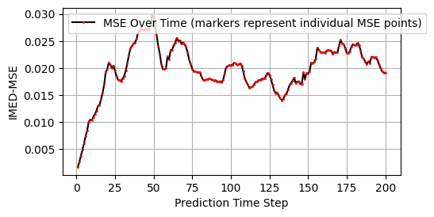

#### **Applying ESN to CESM - Kuroshio Region**

After loading all available CESM data we now have 3 daily data data from 2025-2041 i.e. ~2000 files, which is plenty for training the model and what is even better is that it also runs reasonably fast (~260s) thanks to the great work by Jacob! 

I have changed the hyperparameter slightly from the base case documented [here](./Hyperparameter_Tuning_SWE.md)

- sigma_xy = 1

- k = 0.5

- N_PC = 350

see yaml file [here](./esn_arguments_kuro_esn_10.yaml)

**Results**

[Animation](./comparison_kuro_esn_10.mp4)
