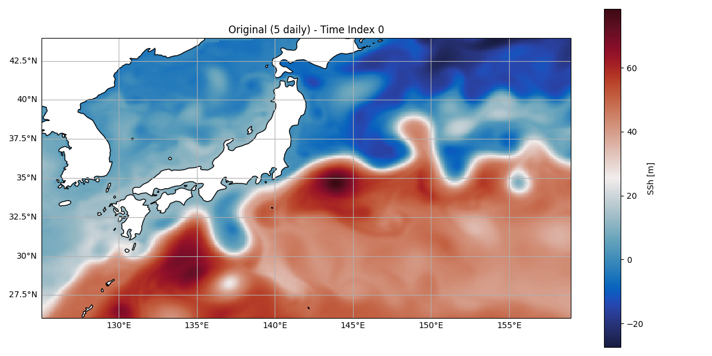
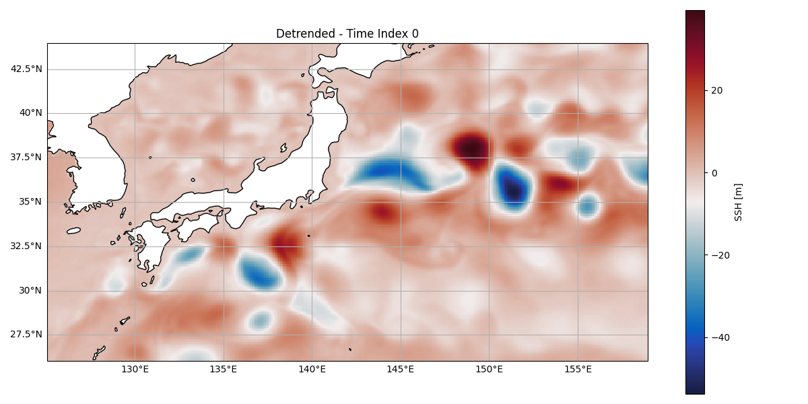
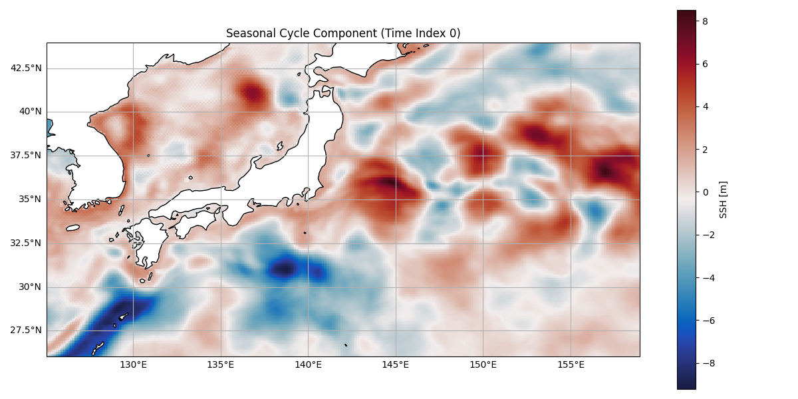
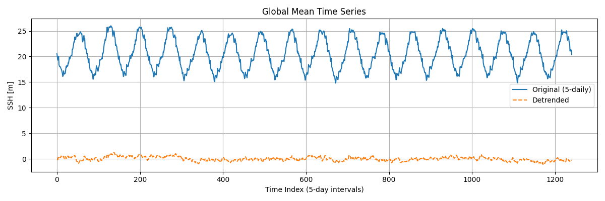
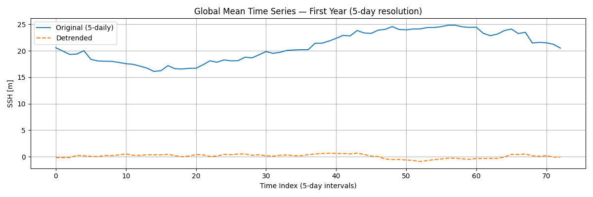

#### **<u>Detrending<u>**

First I re-sampled the dataset, so we now have 5 daily data instead of 3 daily i.e. the number of days in a year is an integer. 

Then I fitted a quadratic function to the data - the polynomial trend using the toolbox written by Niklas & James (https://github.com/nmheim/torsk/blob/master/torsk/data/detrend.py), which was then substracted from the original dataset. 

Thus, we receive a detrended version and a cycle component, which is the average year (average cycle in general). This can also be used to then reconstruct and predict the future as a simple prediction model to showcase our beautiful ESN.

The respective jupyter notebook can be accessed [here](/code/detrend_notebook.ipynb) 

I also found a nice hyperparameter setting for the detrended fields, documented [here](./esn_arguments_47.yaml)

and see animation [here](./comparison_47.mp4)

However, the model gets too eddying/ turbulent if used with too long prediction times, as illustrated [here](./comparison_46.mp4)

