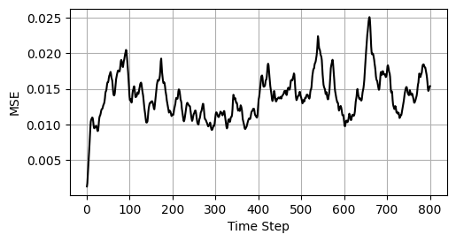
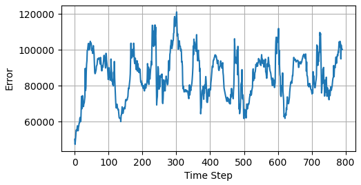
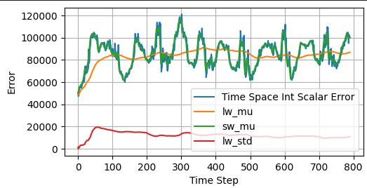
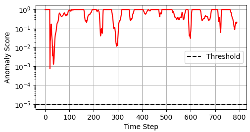

#### **Applying ESN to CESM - Kuroshio Region with modified plots and integrated anomaly detection**

For hyperparameters see [here](./esn_arguments_48.yaml)

[▶ Watch Animation Inline](https://hannah-melzer.github.io/ESN_MA_Thesis/video.html)

[Click here for Animation](./comparison_48.mp4)

